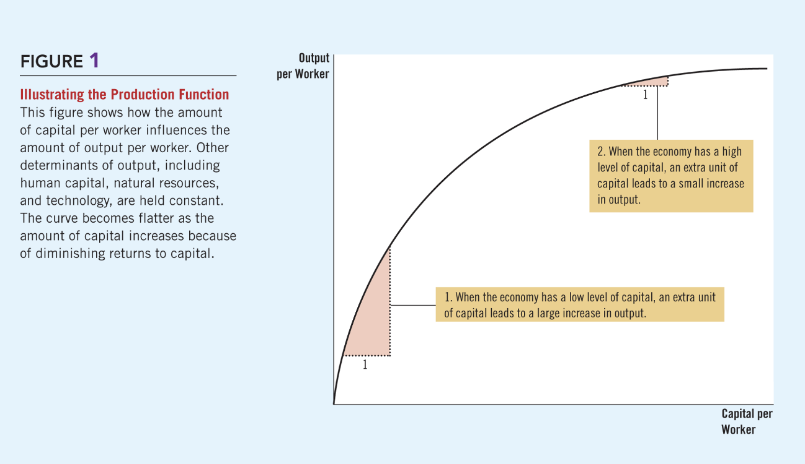

# 🚀 Chapter 25: Production and Growth

Economic growth varies significantly across the globe. We measure these differences using **Real GDP per person**, which serves as a primary indicator of the standard of living in a country.

---

## 1. Introduction to Economic Growth
* **Variation:** Living standards vary widely from country to country.
* **Growth Rate:** This measures how rapidly real GDP per person grows in a typical year. Because growth rates differ, the ranking of countries by income can change substantially over time.

---

## 2. The Power of Productivity
Productivity is the quantity of goods and services produced from each unit of labor input. It is the single most important determinant of living standards.

> **Core Principle:** An economy’s income is the economy’s output. If productivity grows, living standards grow.

### The Four Determinants of Productivity
1.  **Physical Capital:** The stock of equipment and structures used to produce goods and services (e.g., machinery, buildings).
2.  **Human Capital:** The knowledge and skills workers acquire through education, training, and experience.
3.  **Natural Resources:** Inputs provided by nature, such as land, rivers, and mineral deposits.
4.  **Technological Knowledge:** Society’s understanding of the best ways to produce goods and services (e.g., the invention of the assembly line).

---

## 3. Are Natural Resources a Limit to Growth?
There is an ongoing debate about whether the earth's fixed supply of natural resources will eventually stop economic growth.

* **The Argument:** Malthusian theory suggests that as the population grows, resources will run out, forcing living standards to fall.
* **The Counter-Argument:** Technological progress often finds ways around these limits through recycling, new materials, and more efficient resource use.
* **The Market Signal:** Market prices reflect scarcity. Over long periods, the prices of most natural resources have remained stable or even fallen, suggesting innovation is outpacing depletion.

---

## 4. Public Policy and Investment

### Saving and Investment
To raise future productivity, a society must invest more current resources in the production of capital. This requires a trade-off: to have more capital in the future, we must consume less today.

### Diminishing Returns and the Catch-up Effect
* **Diminishing Returns:** As the stock of capital rises, the extra output produced from an additional unit of capital falls.
* **Catch-up Effect:** Countries that start off poor tend to grow more rapidly than countries that start off rich. Even a small amount of capital investment in a poor country can substantially increase productivity.

  
  

    Figure 1: The Production Function. Note how the curve flattens as capital per worker increases due to diminishing returns.
  

### Investment from Abroad
Governments can also promote growth by encouraging investment from overseas:

| Investment Type | Description |
| :--- | :--- |
| **Foreign Direct Investment (FDI)** | Capital investment owned and operated by a foreign entity. |
| **Foreign Portfolio Investment** | Investment financed with foreign money but operated by domestic residents. |

---

## 5. Human Capital: Education and Health
* **Education:** Investment in human capital. While it conveys positive externalities to society, poor countries often suffer from **"Brain Drain"**, where the most educated workers emigrate to richer countries.
* **Health and Nutrition:** Healthier workers are more productive. This creates a **Virtuous Circle**: economic growth improves health outcomes, which in turn fuels more growth.

---

## 6. Stability, Trade, and Innovation
* **Property Rights:** The ability of people to exercise authority over the resources they own. Without clear property rights and political stability, internal markets fail and foreign investors stay away.
* **Free Trade:** Outward-oriented policies (integrating into the world economy) are generally more successful than inward-oriented policies.
* **Research & Development:** Knowledge is a public good. Governments encourage R&D through research grants and the patent system.

---

## 7. Population Growth
Population growth has three main effects on the economy:
1.  **Stretching Natural Resources:** More people means more demand for finite resources.
2.  **Diluting Capital:** High population growth spreads capital thinner among workers, lowering productivity per worker.
3.  **Promoting Tech Progress:** More people means more scientists, inventors, and engineers to drive innovation.

---

## 🌍 Case Study: Why is Africa Poor?
Sub-Saharan Africa remains among the poorest regions in the world. Key reasons include:
* Low capital investment and poor health.
* Geographic disadvantages and the legacy of colonization.
* Rampant corruption and restricted economic freedom.

---

## 📝 Practice Quiz

  
  

    
<strong>1. Which determinant of productivity refers to the "knowledge and skills that workers acquire"?</strong>

    <label style="display: block;"><input type="radio" name="q1" value="A"> A) Physical Capital</label>
    <label style="display: block;"><input type="radio" name="q1" value="B"> B) Human Capital</label>
    <label style="display: block;"><input type="radio" name="q1" value="C"> C) Natural Resources</label>
    

  

  

    
<strong>2. The "catch-up effect" suggests that:</strong>

    <label style="display: block;"><input type="radio" name="q2" value="A"> A) Rich countries will always grow faster</label>
    <label style="display: block;"><input type="radio" name="q2" value="B"> B) Poor countries tend to grow more rapidly than rich countries</label>
    <label style="display: block;"><input type="radio" name="q2" value="C"> C) All countries will eventually have the same GDP</label>
    

  

  

    
<strong>3. If a US company opens and operates a new factory in Vietnam, this is:</strong>

    <label style="display: block;"><input type="radio" name="q3" value="A"> A) Foreign Portfolio Investment</label>
    <label style="display: block;"><input type="radio" name="q3" value="B"> B) Domestic Investment</label>
    <label style="display: block;"><input type="radio" name="q3" value="C"> C) Foreign Direct Investment (FDI)</label>
    

  

  

    
<strong>4. Why are property rights essential for economic growth?</strong>

    <label style="display: block;"><input type="radio" name="q4" value="A"> A) They allow the government to tax citizens more easily</label>
    <label style="display: block;"><input type="radio" name="q4" value="B"> B) They encourage saving and investment by protecting assets</label>
    <label style="display: block;"><input type="radio" name="q4" value="C"> C) They prevent brain drain from occurring</label>
    

  

  

    
<strong>5. Which of the following is an "outward-oriented" policy?</strong>

    <label style="display: block;"><input type="radio" name="q5" value="A"> A) Imposing high tariffs on imported cars</label>
    <label style="display: block;"><input type="radio" name="q5" value="B"> B) Restricting foreign travel for citizens</label>
    <label style="display: block;"><input type="radio" name="q5" value="C"> C) Eliminating barriers to international trade</label>
    

  

  

    <button onclick="checkQuiz25()" style="background-color: #2ea44f; color: white; border: none; padding: 12px 25px; border-radius: 6px; cursor: pointer; font-weight: bold;">Submit & Reveal Answers</button>
    <h3 id="score-display" style="margin-top: 20px;"></h3>
  

---
[⬅ Back to Chapter 24 (Inflation)](index24.html) | [🏠 Home](index.html)
