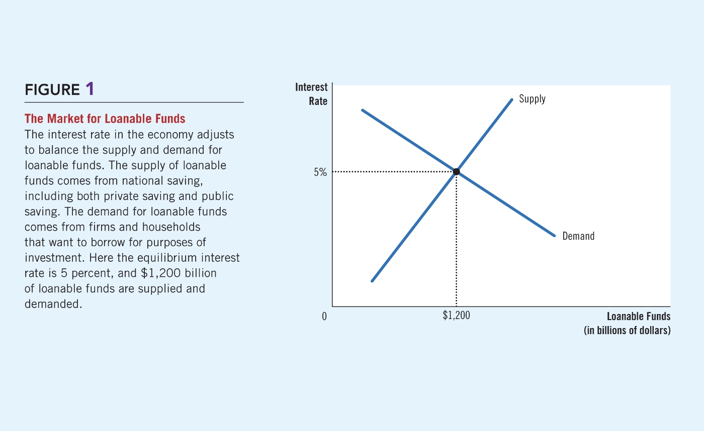
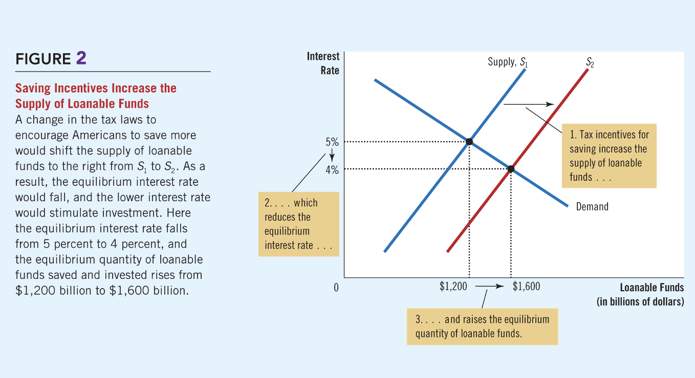
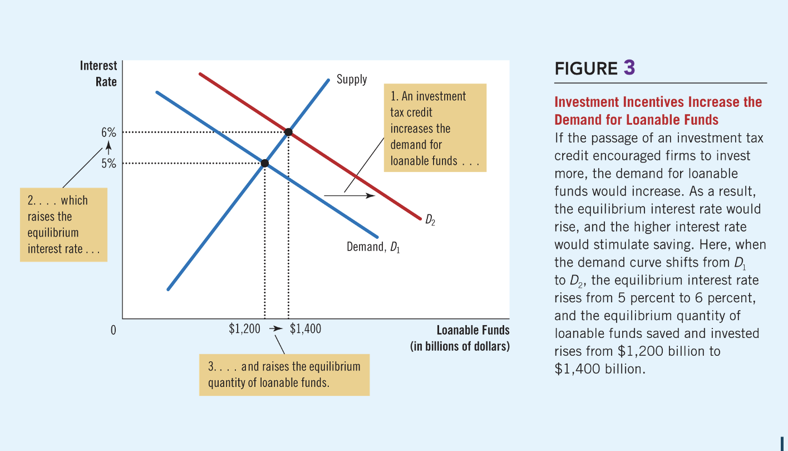
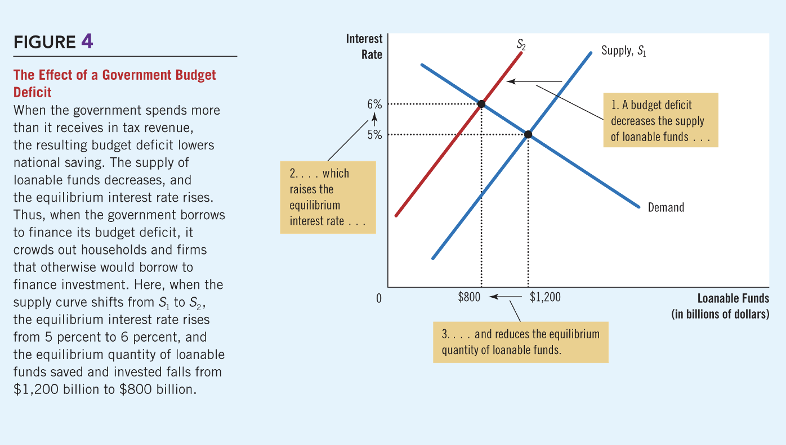

# 💹 Chapter 26: Saving, Investment, and the Financial System

The financial system consists of institutions that help match one person’s saving with another person’s investment, effectively moving scarce resources from savers to borrowers.

---

## 🏦 1. Financial Institutions

### Financial Markets
Through financial markets, savers provide funds **directly** to borrowers.

| Market | Key Characteristics |
| :--- | :--- |
| **The Bond Market** | A certificate of indebtedness (IOU). Terms include **Maturity**, **Credit Risk** (probability of default), and **Tax Treatment**. |
| **The Stock Market** | Represents partial ownership in a firm. Unlike bonds (**Debt Finance**), stocks are considered **Equity Finance**. |

### Financial Intermediaries
These institutions allow savers to **indirectly** provide funds to borrowers.
* **Banks:** Take deposits and make loans. They also facilitate the economy by providing a medium of exchange (checks/debit cards).
* **Mutual Funds:** Sell shares to the public and buy a diversified portfolio. This allows small savers to access professional management and diversification.

---

## 🧮 2. National Income Accounts & Identities

Macroeconomic variables are linked by identities—equations that are true by definition.

### The GDP Identity
In an open economy, the identity is:
$$Y = C + I + G + NX$$

In a **Closed Economy** (where $NX = 0$), the identity simplifies to:
$$Y = C + I + G$$

### National Saving
National saving ($S$) is the total income remaining after paying for consumption and government purchases:
$$S = Y - C - G$$

For the economy as a whole, **Saving must equal Investment**:
$$S = I$$

### Components of Saving
Saving can be split into private and public components:
$$S = (Y - T - C) + (T - G)$$

* **Private Saving $(Y - T - C)$:** Income left after taxes and consumption.
* **Public Saving $(T - G)$:** Tax revenue left after government spending.
    * **Budget Surplus:** If $T > G$.
    * **Budget Deficit:** If $T < G$.

---

## ⚖️ 3. The Market for Loanable Funds

This model explains how the financial system coordinates saving and investment.

* **Supply:** Comes from national saving. A higher interest rate makes saving more attractive, increasing the quantity supplied.
* **Demand:** Comes from households and firms wishing to borrow for investment. A higher interest rate makes borrowing more expensive, decreasing the quantity demanded.

  
  

    Figure 1: The Market for Loanable Funds. The interest rate adjusts to balance the supply of saving and the demand for investment.
  

---

## 🏛️ 4. Government Policies & Impact

### Policy 1: Saving Incentives
Tax laws that encourage saving (e.g., lower taxes on interest) shift the **Supply curve to the right**.
* **Result:** Lower interest rates and higher investment.

  
  

    Figure 2: Saving Incentives. A change in tax laws to encourage saving shifts the supply of loanable funds to the right.
  

### Policy 2: Investment Incentives
An investment tax credit increases the demand for borrowing, shifting the **Demand curve to the right**.
* **Result:** Higher interest rates and higher saving/investment.

  
  

    Figure 3: Investment Incentives. An investment tax credit increases the demand for loanable funds, shifting the curve to the right.
  

### Policy 3: Budget Deficits & "Crowding Out"
When the government runs a deficit, it borrows to finance the shortfall, shifting the **Supply curve to the left**.
* **Crowding Out:** The decrease in private investment resulting from government borrowing.
* **Result:** Higher interest rates and lower investment.

  
  

    Figure 4: The Effect of a Budget Deficit. When the government spends more than it receives, it reduces the supply of loanable funds, leading to "Crowding Out."
  

---

## 🇺🇸 5. History of U.S. Government Debt
The U.S. debt-to-GDP ratio fluctuates based on major events:
* **Wars:** Primary cause of historical spikes (e.g., WWII reached 107%).
* **1980s-1990s:** Rose due to tax cuts/spending; fell under Clinton due to deficit reduction.
* **21st Century:** Rose again due to tax cuts, the 2008 Financial Crisis, and increased spending.

---

## 📝 Practice Quiz

  

    
<strong>1. A bond that never matures is known as a:</strong>

    <label style="display: block;"><input type="radio" name="q1" value="A"> A) Junk bond</label>
    <label style="display: block;"><input type="radio" name="q1" value="B"> B) Municipal bond</label>
    <label style="display: block;"><input type="radio" name="q1" value="C"> C) Perpetuity</label>
    <label style="display: block;"><input type="radio" name="q1" value="D"> D) Intermediate bond</label>
    

  

  

    
<strong>2. Which of the following equations represents Public Saving?</strong>

    <label style="display: block;"><input type="radio" name="q2" value="A"> A) Y - T - C</label>
    <label style="display: block;"><input type="radio" name="q2" value="B"> B) T - G</label>
    <label style="display: block;"><input type="radio" name="q2" value="C"> C) Y - C - G</label>
    

  

  

    
<strong>3. What is "Crowding Out"?</strong>

    <label style="display: block;"><input type="radio" name="q3" value="A"> A) When savers leave the market</label>
    <label style="display: block;"><input type="radio" name="q3" value="B"> B) Government prevention of stock purchases</label>
    <label style="display: block;"><input type="radio" name="q3" value="C"> C) Reduction in private investment due to government deficits</label>
    

  

  

    
<strong>4. An investment tax credit leads to which result in the loanable funds market?</strong>

    <label style="display: block;"><input type="radio" name="q4" value="A"> A) Supply shifts right, lowering rates</label>
    <label style="display: block;"><input type="radio" name="q4" value="B"> B) Demand shifts right, raising rates</label>
    <label style="display: block;"><input type="radio" name="q4" value="C"> C) Supply shifts left, raising rates</label>
    

  

  

    
<strong>5. Which intermediary allows small savers to diversify professionally?</strong>

    <label style="display: block;"><input type="radio" name="q5" value="A"> A) The Bond Market</label>
    <label style="display: block;"><input type="radio" name="q5" value="B"> B) The Stock Exchange</label>
    <label style="display: block;"><input type="radio" name="q5" value="C"> C) Mutual Funds</label>
    

  

  

    <button onclick="checkQuiz26()" style="background-color: #2ea44f; color: white; border: none; padding: 12px 25px; border-radius: 6px; cursor: pointer; font-weight: bold;">Submit Answers</button>
    <h3 id="score-display" style="margin-top: 20px;"></h3>
  

---
[⬅ Back to Chapter 25](index25.html) | [🏠 Home](index.html)
